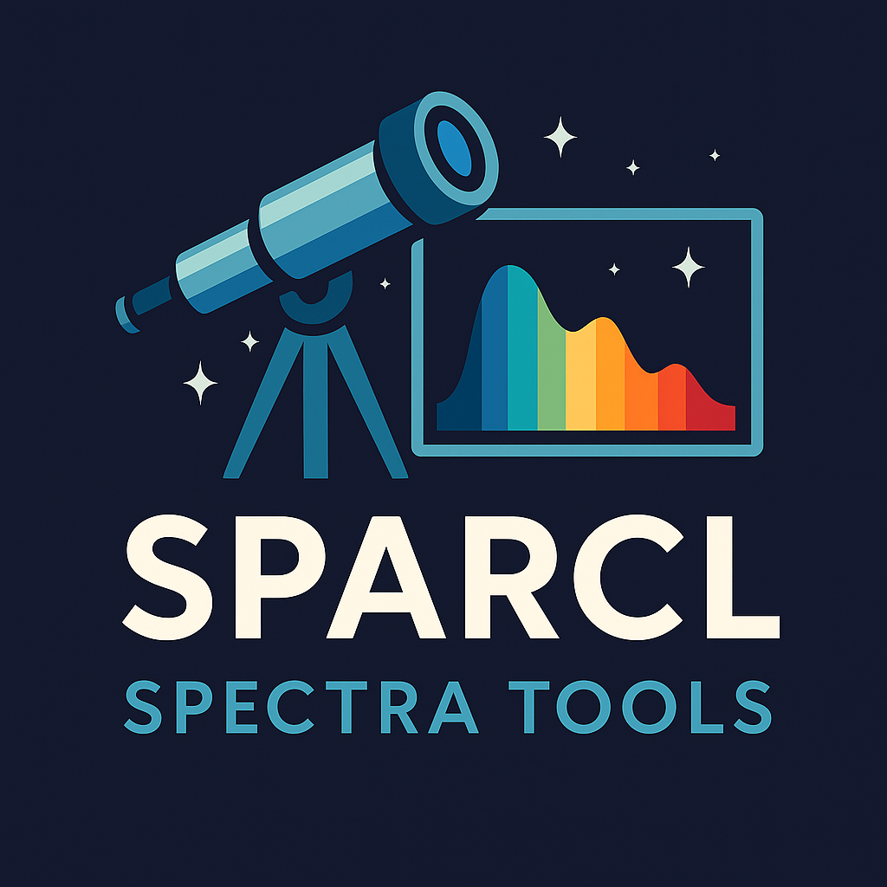
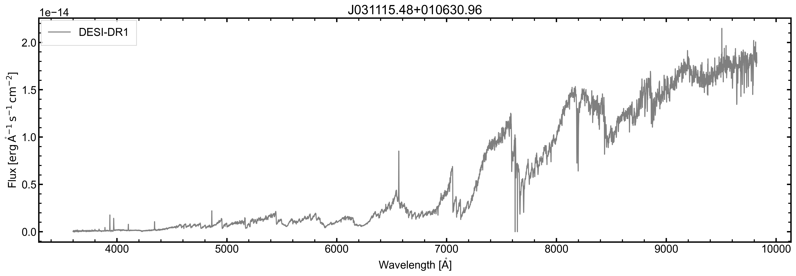
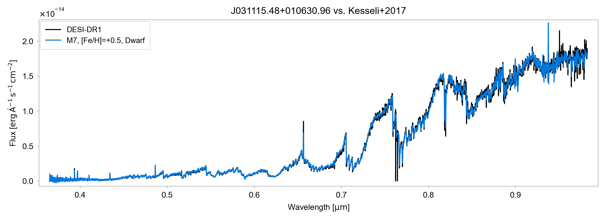

# SPARCL Spectra Tools




This repository provides a suite of Python tools to **download, inspect, and compare astronomical spectra** from the SDSS, BOSS, and DESI surveys, specifically those made accessible via the [SPARCL interface](https://astrosparcl.datalab.noirlab.edu/). These tools simplify access to spectral data and allow comparisons with empirical templates from the literature such as those from Kesseli+2017.

<br/>

## Example Scripts

This repository includes several example scripts demonstrating how to use the `spec_tools` and `flux_comp` modules.

### 1. `download_spectrum_example.py`

This script downloads a single spectrum for an astronomical object located at a specified right ascension (RA) and declination (Dec), with a given search radius:

- Uses `retrieve_objects()` to find targets from SPARCL.
- Fetches the spectrum with `retrieve_spectrum()`.
- Saves the spectrum to a FITS file for further analysis.
- Plots the saved spectrum.

### 2. `compare_spectrum_example.py`

Expands on the download example by:

- Downloading a single spectrum.
- Comparing it against a set of spectral templates (e.g., Kesseli+2017) using the `flux_comp` module.
- Uses the `SED` class to:
  - Compare spectrum and templates.
  - Convert to flux lambda.
  - Plot and display the comparison.

### 3. `bulk_download_example.py`

A batch version that processes a list of object IDs:

- Reads a CSV file (e.g., `ucsheet_x_sparcl.csv`) listing object identifiers.
- Downloads spectra for all listed objects using `retrieve_spectra()`.
- Plots each spectrum with `plot_spectrum()` and saves the plots.

### 4. `bulk_compare_example.py`

Automates comparison of all spectra in a folder:

- Loads all `.fits` files in a given directory.
- For each file:
  - Parses header and data to extract spectral flux and wavelength.
  - Compares the spectrum with template SEDs using `SED.compare()`.
  - Saves a plot if a good match is found.

### 5. Example plots

More examples are available in the `example_plots` folder. 





## Core Functionality — `spec_tools/core.py`

The `core.py` module is the main interface for retrieving and analyzing spectra. Below is a comprehensive description of the available functions:

### `retrieve_objects(ra: float, dec: float, radius: float) -> Table`

Retrieves astronomical objects from the SPARCL database within a specified radius from a given right ascension (RA) and declination (DEC). The function sends a query to the SPARCL database using ADQL (Astronomical Data Query Language) and returns the results as an Astropy Table with additional calculated separation (distance) from the input RA and DEC.

#### Parameters:
- **ra** (`float`): Right Ascension (RA) in degrees of the central point to search around.
- **dec** (`float`): Declination (DEC) in degrees of the central point to search around.
- **radius** (`float`): Search radius in arcseconds to define the search area around the given RA and DEC.

#### Returns:
- **Table**: An Astropy Table containing the queried objects with their properties such as `sparcl_id`, `specid`, `ra`, `dec`, `spectype`, etc., along with the calculated separation (distance) from the input coordinates, sorted by the closest distance. If no objects are found, `None` is returned.

---

### `retrieve_spectrum(data: dict, data_releases: list = ["SDSS-DR16", "BOSS-DR16", "DESI-EDR", "DESI-DR1"], save_spectrum=False, output_dir=tempfile.gettempdir()) -> tuple[fits.BinTableHDU, str]`

Retrieves the spectrum of an astronomical object from the SPARCL database and returns the spectrum in FITS format.

#### Parameters:
- **data** (`dict`): A dictionary (output of function `retrieve_objects`) containing metadata about the astronomical object, including:
  - `sparcl_id`: str, The unique identifier for the object in the SPARCL database.
  - `specid`: str, The unique spectrum ID of the object.
  - `ra`: float, Right Ascension (RA) of the object in degrees.
  - `dec`: float, Declination (DEC) of the object in degrees.
  - `spectype`: str, The spectral type of the object.
  - `redshift`: float, The redshift value of the object.
  - `redshift_err`: float, The uncertainty in the redshift value.
  - `data_release`: str, The data release version (e.g., "SDSS-DR16").
  - `dateobs_center`: str, The observation date of the object.
  - `site`: str, The observing site.
  - `telescope`: str, The telescope used for the observation.
  - `instrument`: str, The instrument used to observe the object.
  
- **data_releases** (`list`, optional): A list of data release versions to query for the spectrum. Default is `["SDSS-DR16", "BOSS-DR16", "DESI-EDR", "DESI-DR1"]`.
- **save_spectrum** (`bool`, optional): If `True`, the retrieved spectrum will be saved as a FITS file in the specified output directory. Default is `False`.
- **output_dir** (`str`, optional): The directory where the spectrum FITS file will be saved, if `save_spectrum=True`. Default is the system's temporary directory.

#### Returns:
- **tuple**: 
  - `fits.BinTableHDU`: A FITS Binary Table HDU (Header Data Unit) containing the spectrum's wavelength and flux data, along with a header that includes the metadata.
  - `str`: The data release from which the spectrum was obtained (e.g., "SDSS-DR16"). If no spectrum is found, both values will be `None`.

---

### `retrieve_spectra(object_ids: iter, data_releases: list = ["SDSS-DR16", "BOSS-DR16", "DESI-EDR", "DESI-DR1"], output_dir=tempfile.gettempdir()) -> tuple[list, str]`

Retrieves the spectra of multiple astronomical objects from the SPARCL database and saves them as FITS files.

#### Parameters:
- **object_ids** (`iter`): An iterable of unique identifiers (e.g., list, tuple) for the astronomical objects whose spectra are to be retrieved.
- **data_releases** (`list`, optional): A list of data release versions to query for the spectra. Default is `["SDSS-DR16", "BOSS-DR16", "DESI-EDR", "DESI-DR1"]`.
- **output_dir** (`str`, optional): The directory where the FITS files for the retrieved spectra will be saved. Default is the system's temporary directory.

#### Returns:
- **list**: A list of file paths (strings) where the FITS files for each spectrum were saved.
- **str**: The data release from which the spectra were obtained. If no spectra are found, both values will be `None`.

---

### `plot_spectrum(hdu, output_dir=tempfile.gettempdir(), open_plot=True, plot_format="pdf")`

Plots the spectrum of an astronomical object (wavelength vs. flux) and saves the plot to a specified directory.

#### Parameters:
- **hdu** (`astropy.io.fits.BinTableHDU`): The HDU containing the spectrum data as returned by `retrieve_spectrum()`.
- **output_dir** (`str`, optional): Directory where the plot will be saved. Defaults to the system's temporary directory.
- **open_plot** (`bool`, optional): If `True`, the plot will be opened automatically after saving. Defaults to `True`.
- **plot_format** (`str`, optional): The format to save the plot as (e.g., "pdf", "png"). Defaults to "pdf".

#### Returns:
- **None**: The function saves the plot as an image file and optionally opens it.

---

### `redshift_to_velocity(z, sigma_z)`

Calculate the radial velocity and its uncertainty from the redshift for stars.

This function uses the small redshift approximation to convert redshift to radial velocity for stars. It also propagates the uncertainty in the redshift to the radial velocity using the error propagation formula.

#### Parameters:
- **z** (`float`): The redshift (dimensionless).
- **sigma_z** (`float`): The uncertainty in the redshift (dimensionless).

#### Returns:
- **tuple**: A tuple containing the radial velocity (in km/s) and its uncertainty (in km/s).

---

### `create_object_name(ra, dec, precision=0, sep="", prefix=None, shortform=False, decimal=True)`

Generate a string-based object name from celestial coordinates.

#### Parameters:
- **ra** (`float`): Right Ascension in degrees.
- **dec** (`float`): Declination in degrees.
- **precision** (`int`, optional): Number of decimal places for coordinates (default is 0).
- **sep** (`str`, optional): Separator to use in formatted output (default is "").
- **prefix** (`str`, optional): String to prepend to the object name.
- **shortform** (`bool`, optional): If `True`, returns a short HMS/DMS form like '1234+5678'.
- **decimal** (`bool`, optional): If `True`, returns decimal-formatted coordinates.

#### Returns:
- **str**: A formatted object name string.

---

### `open_file(filename)`

Opens a file using the default application based on the operating system.

#### Parameters:
- **filename** (`str`): The path to the file to be opened.

#### Behavior:
- On Windows (`win32`), the file will be opened using the default associated application.
- On macOS (`darwin`), the file will be opened using the `open` command.
- On Linux and other Unix-like systems, the file will be opened using the `evince` viewer (can be changed to another viewer).

## Dependencies

This repository requires the following Python packages:

- [`aiohttp`](https://pypi.org/project/aiohttp/)
- [`astropy`](https://www.astropy.org/)
- [`astroquery`](https://astroquery.readthedocs.io/)
- [`matplotlib`](https://matplotlib.org/)
- [`numpy`](https://numpy.org/)
- [`requests`](https://pypi.org/project/requests/)
- [`sparclclient`](https://astrosparcl.datalab.noirlab.edu/)
- [`scipy`](https://scipy.org/)

## Installation

To install the Spec Tools package, clone the repository and install the dependencies:

```bash
git clone https://github.com/fkiwy/Spec_tools.git
cd Spec_tools
pip install .
```